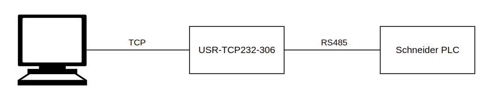

# Pyunitelway NUM 1060

This is a fork of the original [Pyunitelway](https://github.com/Purecontrol/pyunitelway) library adapted to work with the NUM 1060.

This library allows to:

* Send and receive mirror requests
* Query unit identification
* Query unit status data
* Query available memory
* Send supervisor messages
* Read and write objects

## Relevant documentation

* [Schneider Electric - UNI-TELWAY reference manual](https://download.schneider-electric.com/files?p_enDocType=User+guide&p_File_Name=35000789_K06_000_00.pdf&p_Doc_Ref=35000789K01000)
* [NUM 1060 - USE OF THE UNI-TE PROTOCOL - en-938914/0](https://shop.num.com/pi/Spezifische-Handbuecher/NUM-10xx-Power-Axium/Spezifische-Dokumentation/spezifische-dokumente-vers-e.html)
* [NUM 1020/1040/1060 - UNI-TELWAY INTEGRATION MANUAL - 0101938880/2](https://shop.num.com/pi/Spezifische-Handbuecher/NUM-10xx-Power-Axium/Spezifische-Dokumentation/spezifische-dokumente-vers-e.html)
* [NUM - AUTOMATIC CONTROL FUNCTION PROGRAMMING MANUAL LADDER LANGUAGE - 0101938846/8](https://shop.num.com/pi/Spezifische-Handbuecher/NUM-10xx-Power-Axium/NUMTool-Workshop/num-tool-workshop-handbcher.html)

## How to use ?

This library is designed to use a TCP-RS485 adapter. The adapter is connected to the PC or server which uses this lib via Ethernet or Wi-fi or anything else, and is connected to the NUM 1060 via RS232 on port COMM1 at the UC SII. Parameter
P112 has to be configured accordingly and the port has to be changed to "I-Port is private to PLC".

This library was developed using the USR-TCP232-306 adapter. It was not tested with another kind of connection.

*Test setup*
