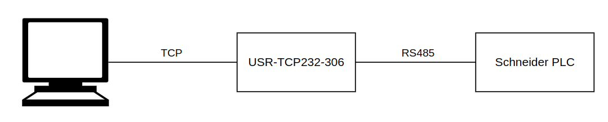

pyunitelway for the NUM 1060
============================

A UNI-TELWAY slave client plus UNI-TE requests for the NUM 1060 Series II CNC of the IMA BIMA
Quadroform C80/280 at Makerspace Darmstadt. Fork of
`Purecontrol/pyunitelway <https://github.com/Purecontrol/pyunitelway>`_.

Status: prototype, run ad hoc from a laptop. Everything below was verified on the machine; the frames are
regression vectors in ``tests/test_hardware_vectors.py`` and the history is in the repository's todo.md.

Reads

* ``mirror``, ``get_unit_identification``, ``get_unit_status`` (NC and PLC state, segment 153), ``get_available_bytes_in_ram``,
  ``get_stations_managed_by_master``, ``get_unit_fault_history``
* ``read_object`` / ``read_mode`` - NC objects (938914 §4.1.3)
* ``read_ladder`` - PLC variables ``%M %V %I %Q %R %W %S`` as bit, byte, word or long word
* ``read_directory``, ``read_program``, ``read_machine_parameters``, ``read_plc_archive``, ``read_macros``,
  ``read_axis_calibration`` - the files of the NC RAM (938914 §4.13, §4.16), all of them behind ``poetry run backup``
* ``read_cycle_in_progress`` (``%R3.2``), ``read_cycle_stopped`` (``%R3.1``), ``read_vacuum_pump``,
  ``read_extraction_hood``, ``read_long_workpiece``, ``read_wide_workpiece``

Writes and actions, each locked until ``UnitelwayClient(writable={...})`` names it

* ``write_mode`` (``Object.MODE_SELECTION``), ``write_object``, ``write_ladder`` (a segment such as ``"%W"`` or a
  variable such as ``"%W16.B"``; ``%W3.2`` is NC start), ``write_message`` (the NC screen)
* ``write_vacuum_pump``, ``write_extraction_hood``, ``write_long_workpiece``, ``write_wide_workpiece`` - the panel
  latches ``%Q0700.6``, ``%Q0100.3``, ``%Q0100.4``, ``%Q0101.4``
* ``cycle_start`` (``Action.CYCLE_START``): UNI-TE Run, starts what the NC would start on CYCLE START;
  ``cycle_stop`` (``Action.CYCLE_STOP``): the CYHLD machining stop, the spindle keeps turning
* ``write_program`` (``Action.WRITE_PROGRAM``): stores one part programme (938914 §4.12) and reads it back;
  ``delete_program`` (``Action.DELETE_PROGRAM``): Delete-File (§4.14). Both refuse IMA's programme numbers and
  ``%9000`` upward, a running or editing NC and the active programme before anything is sent, and
  ``write_program`` never writes to a number the directory lists.

``ALL_LADDER_SEGMENTS`` and ``ALL_NC_OBJECTS`` open every ladder segment and NC object; the ``Action`` locks must
always be named explicitly.

.. toctree::
   :maxdepth: 2
   :caption: Contents:

   ./configuration.rst
   ./logging.rst
   ./client.rst
   ./num_constants.rst
   ./unite_responses.rst
   ./conversion.rst
   ./utils.rst
   ./errors.rst

Quick start
===========

::

    import logging
    from pyunitelway import UnitelwayClient

    logging.basicConfig(level=logging.INFO)
    client = UnitelwayClient()                 # link address 0x01, the one this master polls
    client.connect_socket("10.1.70.202", 8234)
    client.mirror([0x00])                      # True
    client.read_mode()                         # <Mode.AUTO: 0>
    client.read_ladder("%R1A.W")               # 9001 - the active programme
    client.get_unit_status()["nc_status"]      # {'cnc_ready': True, 'active_program': False, ...}
    client.disconnect_socket()

Scripts: ``poetry run listen`` receives only and lists the link addresses the master polls;
``poetry run test`` is a tour of every request, writes commented out; ``poetry run panel`` renders the machine's operator panel (buttons, lamps, key
switch, potentiometers) from ``%I0100``-``%I0104`` / ``%Q0100``-``%Q0102``, read-only, ``--watch 1``
to refresh; ``poetry run backup`` writes a full backup (every part programme, the machine parameters, the PLC
archive, macros, axis calibration) into ``example/backup/<timestamp>/``.

Setup
=====

PC -> USR-TCP232-306 (TCP server mode) -> RS232 -> NUM 1060 UC SII, port COMM1. NUM parameter P112
must match the serial settings and the port must be set to *"I-Port is private to PLC"*.

   Tested setup - see :doc:`Configuration </configuration>`

Indices and tables
==================

* :ref:`genindex`
* :ref:`modindex`
* :ref:`search`
